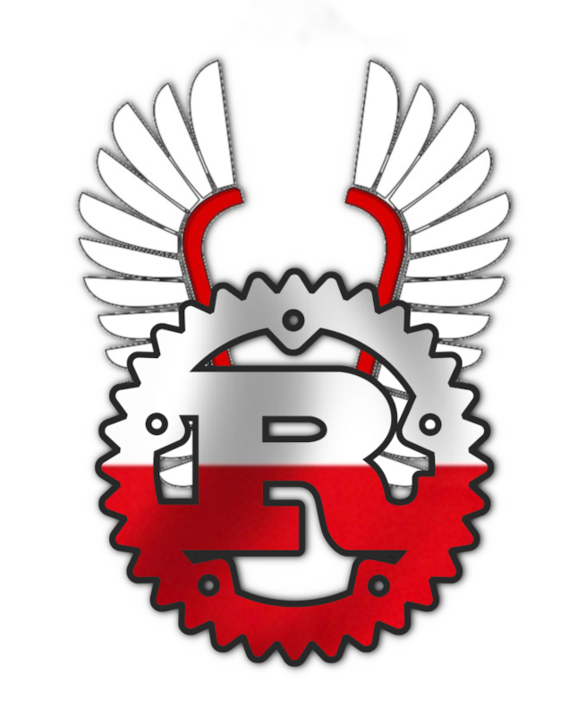

# rdza



Aren't you _wkurwiony/a_ from writing Rust programs in English? Do you like saying
"kurwa" a lot? Would you like to try something different, in an exotic and
funny-sounding language? Would you want to bring some **Polish** to your
programs?

**rdza** (Polish for _Rust_) is here to save your day, as it allows you to
write Rust programs in Polish, using Polish keywords, Polish function names,
Polish idioms.

This has been designed to be used as the official programming language to
develop the future Polish sovereign operating system.

You don't feel at ease using only Polish words? Don't worry!
Polish Rust is fully compatible with English-Rust, so you can mix both at your
convenience.

Here's an example of what can be achieved with Rdza:

### trait and impl (aka cecha i implementacja)

```rust
rdza::rdza! {
    zewnętrzna skrzynka rdza;

    użyj standardowe::kolekcje::MapaHaszy jako Mapa;

    cecha WartościPoKluczu {
        funkcja zapisz(&się, klucz: Ciąg, wartość: Ciąg);
        funkcja wczytaj(&się, klucz: Ciąg) -> Wynik<Opcja<&Ciąg>, Ciąg>;
    }

    statyczna zmienna SŁOWNIK: Opcja<Mapa<Ciąg, Ciąg>> = Żadna;

    struktura Słownik;

    implementacja WartościPoKluczu dla Słownik {
        funkcja zapisz(&się, klucz: Ciąg, wartość: Ciąg) {
            niech słownik = niebezpieczne {
                SŁOWNIK.wyjmij_lub_wstaw_z(Domyślny::domyślny)
            };
            słownik.wstaw(klucz, wartość);
        }
        funkcja wczytaj(&się, klucz: Ciąg) -> Wynik<Opcja<&Ciąg>, Ciąg> {
            jeżeli niech Jakiś(słownik) = niebezpieczne { SŁOWNIK.jako_referencja() } {
                Dobrze(słownik.wyjmij(&klucz))
            } inaczej {
                Źle("nie ma słownika".do())
            }
        }
    }
}
```

### Support for regional languages

```rust
#[pozwól(nieosiągalny_kod)]
funkcja druga() {
    kurwa!("zjebało się"); // for the true Polish experience
    jerōnie!("motyka"); // for friends speaking ślōnska gŏdka
    panikuj!("motyla noga"); // in SFW contexts
}
```

### Other examples

See the [examples](./examples/src/main.rs) to get a rough sense of the whole
syntax. Proszę, that's it.

## Kontrybucje

First of all, _dzięki wielkie_ for considering participating to this joke, the
Polish government will thank you later! Feel free to throw in a few identifiers
here and there, and open a pull-request against the `główna` (Polish for
`main`) branch.

## Other languages

- French (original): [rouille](https://github.com/bnjbvr/rouille)
- Dutch: [roest](https://github.com/jeroenhd/roest)
- German: [rost](https://github.com/michidk/rost)

## Podziękowania

- [@bnjbvr](https://github.com/bnjbvr) for making the original macro.

## Licencja

[WTFPL](http://www.wtfpl.net/).
